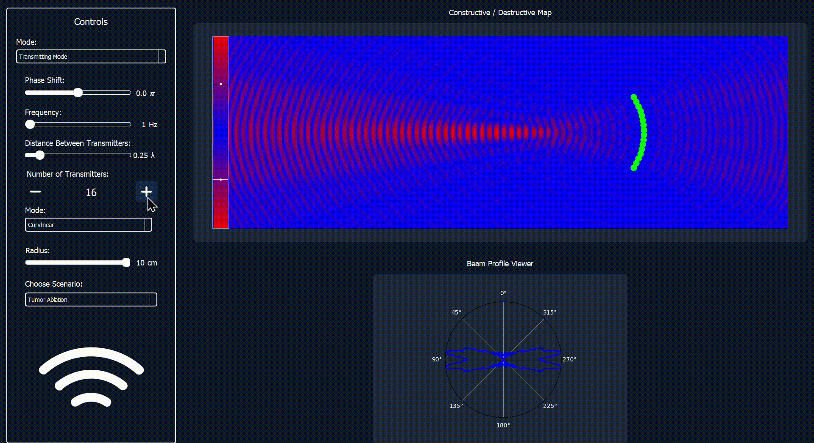
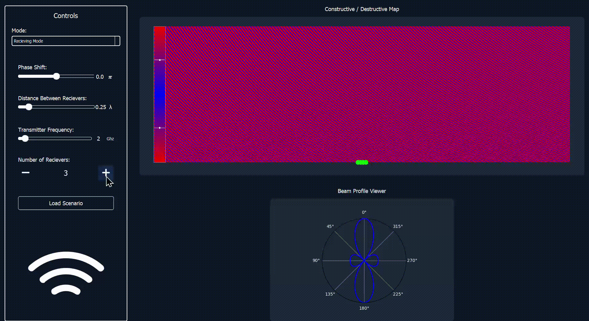

# Beamforming-realtime-Simulator


Beamforming is a critical concept in modern technologies, spanning fields such as wireless communications, 5G, radar, sonar, and biomedical applications like ultrasound and tumor ablation. This simulator provides an interactive platform to explore the principles of beamforming, including delays, phase-shifts, and constructive/destructive interference.

## Features

### 1. Real-Time Customization of System Parameters
Users can configure the following parameters to steer the beam direction dynamically:
- **System parameters:**
  - Number of transmitters/receivers
  - Applied delays/phase shifts
  - Number of operating frequencies and their values
.gif)
[Watch the video](assets/changing_parameters.mp4)
- **Geometry of the phased array:**
  - Linear or curved arrays
  - Curvature parameters, which are fully customizable
  
[Watch the video](assets/curvilinear_mode.mp4)

### 2. Visualizations
- **Constructive/Destructive Interference Map:** Visualize the interference patterns generated by the phased array.
- **Beam Profile:** Explore the beam profile across different synchronized viewers.

### 3. Support for Multiple Phased Array Units
- Add multiple phased array units to the simulation.
- Customize the location and parameters of each unit independently.

### 4. Predefined Scenarios
The simulator comes equipped with three predefined scenarios inspired by:
- **5G Communication**: Explore beamforming techniques for high-speed wireless networks.
    - 
    - [Watch the video](assets/5G-mode.mp4)
- **Ultrasound Imaging**: Visualize ultrasound beam patterns used in medical diagnostics.
    - 
    - [Watch the video](assets/Ultrasound-mode.mp4) 
- **Tumor Ablation**: Simulate focused ultrasound for targeted tumor treatment.
    - 
    - [Watch the video](assets/curvilinear_mode.gif) 


Users can:
- Load these scenarios .
- Visualize the preconfigured setup.
- Customize or fine-tune the parameters as needed.
 --- 
## Getting Started, Setup Instructions
#### Clone the repository
```bash
git clone https://github.com/Mostafaali3/Beamforming-realtime-Simulator.git
```
#### Navigate to project directory
```bash
cd Beamforming-realtime-Simulator
```

#### Install required packages
```bash
pip install -r requirements.txt
```

#### Run the application
```bash
python main.py
```

#### Loading Predefined Scenarios
1. Open the simulator.
2. Select a predefined scenario from the "Scenarios" menu.
3. Customize or visualize the scenario as required.

<!-- ## Usage

### 1. Customizing Parameters
- Use the interactive interface to modify system parameters and array geometry.
- Adjust the curvature of arrays to observe changes in beam patterns.

### 2. Visualizing Beamforming
- Toggle between synchronized viewers to explore interference maps and beam profiles.
- Analyze how parameter changes affect the beam direction and intensity.

### 3. Adding Phased Array Units
- Add new phased array units to the system.
- Set their positions and customize their parameters individually. -->


---

## Dependencies

The Multi-Signal Viewer relies on the following technologies and libraries to deliver its robust functionality:

| **Dependency**       | **Description**                                       |
|-----------------------|-------------------------------------------------------|
| Python 3.x           | Core programming language.                            |
| NumPy                | Numerical computations for signal processing.         |
| Pandas               | Data manipulation and analysis.                       |
| SciPy                | Advanced scientific computing and interpolation.      |
| PyQt5                | GUI framework for building desktop applications.      |
| PyQtGraph            | Fast plotting and 2D/3D visualization in PyQt.        |
| matplotlib           | Scientific visualizations library used for the polar plot|

---

<!-- ## License
This project is licensed under the MIT License. See the [LICENSE](LICENSE) file for details. -->

## Contributors <a name="Contributors"></a>
<table>
  <tr>
    <td align="center">
      <a href="https://github.com/Mostafaali3" target="_blank">
        
        <br />
        <sub><b>Mostafa Ali</b></sub>
      </a>
    </td>
    <td align="center">
      <a href="https://github.com/Youssef-Abo-El-Ela" target="_blank">
        
        <br />
        <sub><b>Youssef Abo El-Ela</b></sub>
      </a>
    </td>
    <td align="center">
      <a href="https://github.com/karreemm" target="_blank">
        
        <br />
        <sub><b>Kareem Abdel Nabi</b></sub>
      </a>
    </td>
    <td align="center">
      <a href="https://github.com/AhmedXAlDeeb" target="_blank">
        
        <br />
        <sub><b>Ahmed AlDeeb</b></sub>
      </a>
    </td>
  </tr>
</table>

Thank you for using the Beamforming Simulator!

